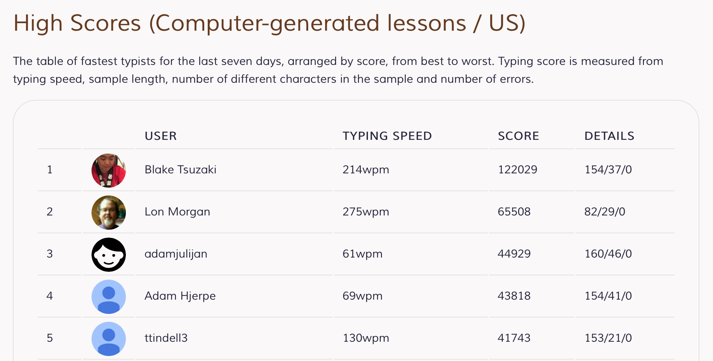

# KeyHax
A simple script to beat Keybr, a typing lesson site.

This is a simple script written in AppleScript that opens a new Safari window and, well, proceeds to type for you (lame, I know). Written thanks to the help of my boredom during midterms, because science ✌️

__Warning:__ May cause gloating, retaliatory violence, or loss of friendships

...not to mention you'd be violating, like, some clause in Keybr's [Terms of Service] (http://www.keybr.com/pages/termsofservice)

## Usage
Download and run in Script Editor or any equivalent script editing program for AppleScript

##License
I dunno